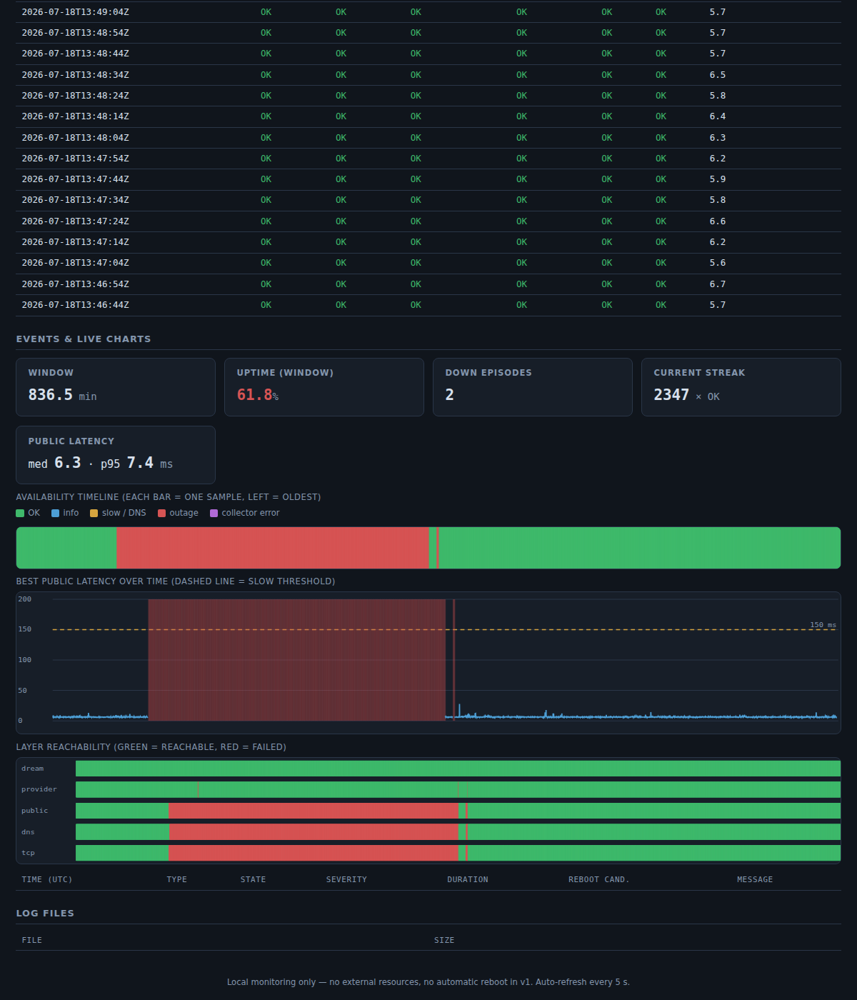

# internet-telemetry

**Proxmox-based home internet monitoring server with a local web dashboard.**

Continuously monitors your home internet path, classifies outages
(local LAN vs provider router vs ISP upstream vs DNS vs slow), logs
telemetry to JSONL/CSV, and serves an offline-capable web dashboard
with a configuration page — all from a tiny Debian LXC container
(1 core, 512 MB RAM, Python standard library only).

```text
Provider coax router/modem  →  Dream Router 6  →  Home LAN  →  Proxmox node  →  monitoring LXC
```

**Version 1 is monitoring-only.** It never reboots anything, never runs
speed tests, and keeps its own probe traffic under a strict budget
(hard limit: 3% of your configured minimum link speed; default usage
is far below that). The goal is to collect the evidence that shows
*whether* your internet actually fails, before any automation is added.

Full requirements and acceptance tests live in [`docs/SPEC.md`](docs/SPEC.md).

---

## Repository layout

| Path | Purpose |
| --- | --- |
| `create_internet_telemetry_dashboard_lxc.sh` | Installer — run on the Proxmox host |
| `network_telemetry_dashboard.py` | Telemetry collector + dashboard (stdlib only) |
| `internet-telemetry-dashboard.service` | systemd unit installed into the container |
| `internet-telemetry.logrotate` | Log rotation: daily, 30 days, compressed |
| `test_logic.py` | Offline tests for classification/debounce/events |
| `docs/SPEC.md` | Full task specification (revision 2) |

---

## Quick start

Requirements: a Proxmox VE node with a bridge on your home LAN, root
access, and one free container ID.

```bash
# 1. Get the code onto the Proxmox host
git clone <your-remote-url> internet-telemetry
cd internet-telemetry

# 2. Edit the configuration block at the top of the installer
nano create_internet_telemetry_dashboard_lxc.sh
#    At minimum set: CTID, ROOTFS_STORAGE, BRIDGE,
#    LAN_IP_CIDR, GATEWAY, DNS_SERVER, DREAM_IP

# 3. Run it (prints all IPs and asks for confirmation first)
./create_internet_telemetry_dashboard_lxc.sh
```

When it finishes:

```text
Dashboard:      http://<container-ip>:8080
Configuration:  http://<container-ip>:8080/config
```

Every installer variable can also be overridden via environment
instead of editing the file:

```bash
CTID=121 LAN_IP_CIDR=192.168.1.21/24 OUTAGE_AFTER_SEC=300 \
  ./create_internet_telemetry_dashboard_lxc.sh
```

The installer is safe to re-run: it refuses to touch an existing CTID.

---

## What the installer does

1. Verifies it runs as root on a Proxmox host (`pct`/`pveam` present)
   and that all package files sit next to the script.
2. Prints the full configuration and waits for your confirmation
   (`ASSUME_YES=1` skips the prompt).
3. Downloads the newest Debian 12+ standard LXC template if missing.
4. Creates an **unprivileged** container: 1 core, 512 MB RAM,
   256 MB swap, 8 GB disk, static IP, start-on-boot.
5. Installs `python3 iputils-ping iproute2 dnsutils curl
   ca-certificates nano logrotate` inside it.
6. **Verifies ICMP ping works inside the container** — unprivileged
   LXCs need `net.ipv4.ping_group_range` to cover the mapped GIDs; if
   the check fails you get the exact one-line fix instead of a silently
   broken monitor.
7. Test-pings your provider router IPs (informational — "no answer"
   is normal for modems in bridge mode).
8. Deploys the application, generates
   `/etc/internet-telemetry/config.json` from your variables, installs
   the systemd unit and logrotate config, starts the service, and
   waits for `/healthz` to answer.
9. Prints the dashboard URL, useful `pct` commands, and the lock-out
   recovery procedure.

---

## How classification works

Each sample (default every 10 s) pings the Dream Router, the provider
router/modem, and the public targets, then runs DNS lookups and TCP
connects. Quorum rule: "public internet down" means **all** public
targets failed in the same sample — one lost packet is never an outage.

| State | Meaning |
| --- | --- |
| `OK` | Everything healthy |
| `OK_PROVIDER_ROUTER_NOT_REACHABLE` | Internet fine; modem management IP silent (but has answered before) |
| `LOCAL_LAN_OR_DREAM_ROUTER_DOWN` | Dream Router unreachable |
| `PROVIDER_ROUTER_OR_WAN_LINK_DOWN` | LAN up; modem and internet both down |
| `ISP_OR_COAX_UPSTREAM_DOWN` | Modem answers; internet down (coax / ISP upstream) |
| `WAN_DOWN` | Internet down and the modem has *never* answered (bridge mode), so the two rows above cannot be distinguished |
| `DNS_FAILURE` | Internet reachable by IP; all DNS lookups fail |
| `INTERNET_SLOW` | Best public latency above threshold (default 150 ms) for 3 consecutive samples |
| `COLLECTOR_ERROR` | The monitor itself failed — check journalctl |

State changes are debounced (2 consecutive samples; 3 for slow;
collector errors are immediate). A failure lasting longer than the
outage threshold (default 600 s) emits a `persistent_outage` event
with a `reboot_candidate` flag — the evidence base for deciding later
whether reboot automation is justified. **No reboot happens in v1.**

## Live charts

The **Events & live charts** section of the dashboard renders three
self-contained SVG charts (no external libraries, works fully offline),
refreshed every 5 s over the in-memory sample window (default ~2 h at a
10 s interval, set by `keep_samples`):

- **Availability timeline** — one colored bar per sample (green OK,
  amber slow/DNS, red outage), so a bad night is visible at a glance.
- **Best public latency over time** — line chart with the slow
  threshold drawn as a dashed line and outage periods shaded red.
- **Layer reachability** — green/red strips for Dream Router, provider,
  public, DNS and TCP, which immediately shows *which layer* failed.

Hover any bar for the exact timestamp and value. A summary strip above
the charts shows window length, uptime %, number of down episodes, the
current streak, and median / p95 public latency.



## Traffic budget

The monitor must never make a degraded connection worse. Its own
traffic is estimated conservatively from the configured probes and
shown on the dashboard (estimated kbps, budget kbps, usage %, status).
Any configuration whose estimate exceeds
`monitoring_traffic_limit_percent` (max 3%) of the *lower* of your
configured minimum downlink/uplink speeds is **rejected at save
time**. During outages the probe rate never increases; with adaptive
backoff enabled it decreases (1 provider IP, 2 public targets, 1 DNS
name, 1 TCP target).

Set `minimum_expected_downlink_mbps` / `minimum_expected_uplink_mbps`
to conservative worst-case values, not your ISP plan speed.

---

## Configuration

Everything lives in `/etc/internet-telemetry/config.json`, editable at
`http://<ip>:8080/config` (list fields: one item per line). Buttons:

- **Save** — validate and write the file; restart needed to apply.
- **Save and Restart Service** — validate, write, restart. If you
  changed the bind address or port, a warning with the new URL is
  shown and confirmation is required first.
- **Reset to Defaults** — fills the form only; nothing is written
  until you press Save.
- **Download Config** — downloads the current form as `config.json`.

Invalid values (bad IPs, `host:notaport`, interval < 5 s, port outside
1..65535, relative log path, budget exceeded, …) are rejected with a
listed reason and the file is left untouched. A corrupted file on disk
makes the service log the errors and fall back to safe defaults rather
than crash.

## Logs

```text
/var/log/internet-telemetry/
    telemetry_YYYY-MM-DD.jsonl   full raw samples (incl. raw + debounced state)
    summary_YYYY-MM-DD.csv       spreadsheet-friendly summary
    events/*.json                state changes, persistent outages, recoveries
```

Rotated daily, kept 30 days, compressed; event files older than 30
days are pruned by the app. Download via the dashboard's Log files
table or:

```bash
pct exec <CTID> -- tail -n 20 /var/log/internet-telemetry/summary_*.csv
```

## Service management

```bash
pct exec <CTID> -- systemctl status  internet-telemetry-dashboard.service
pct exec <CTID> -- systemctl restart internet-telemetry-dashboard.service
pct exec <CTID> -- journalctl -u internet-telemetry-dashboard.service -f
```

## HTTP API

```text
GET  /              dashboard          GET  /api/status   JSON snapshot
GET  /config        config page        GET  /api/config   current config
GET  /healthz       health check       POST /api/config   validate + save
GET  /log?file=X    download a log     POST /api/config/restart   save + restart
                                       POST /api/config/defaults  default values
```

POST requests require the `X-Requested-With` header (any value) and a
same-site `Origin`; all requests must carry a known `Host` header.
When scripting:

```bash
curl -s -X POST http://<ip>:8080/api/config \
     -H "X-Requested-With: cli" -H "Content-Type: application/json" \
     --data @config.json
```

---

## Troubleshooting

**Every sample is `COLLECTOR_ERROR` / ping fails in the container.**
On the Proxmox **host**:

```bash
echo 'net.ipv4.ping_group_range = 0 2147483647' > /etc/sysctl.d/99-ping.conf
sysctl --system
pct restart <CTID>
```

**Provider router shows "no answer" but internet is fine.** Normal in
bridge mode. If your modem *should* answer on `192.168.100.1`, add a
static route to `192.168.100.0/24` via the WAN interface on the Dream
Router.

**Locked out after changing bind/port.** From the Proxmox host:

```bash
pct exec <CTID> -- nano /etc/internet-telemetry/config.json
pct exec <CTID> -- systemctl restart internet-telemetry-dashboard.service
```

**"Host header not allowed."** You're reaching the dashboard through a
hostname the container doesn't know (reverse proxy, DNS alias). Use
the container IP; DNS-rebinding protection is intentional in v1.

**"Cross-site request rejected."** Add `-H "X-Requested-With: cli"` to
scripted POSTs; the built-in pages already send it.

**Port already in use.** Change `dashboard_port`, or find the conflict
with `pct exec <CTID> -- ss -ltnp`.

---

## Development & tests

The classification, debounce, baseline, event, and budget logic has an
offline test suite (no network needed):

```bash
python3 test_logic.py
```

30 assertions cover every state, the single-blip no-flap rule,
persistent outage → recovery flow, ISP-vs-provider distinction with
and without a provider baseline, the slow-state triple-sample rule,
budget rejection, and adaptive backoff.

Acceptance tests for real hardware are in
[`docs/SPEC.md`](docs/SPEC.md), section 10 (Tests 1–13).

## Security notes

- LAN use only — never port-forward the dashboard to the internet.
  v1 has no authentication by design; the Host/Origin/`X-Requested-With`
  checks defend against browser-based attacks (CSRF, DNS rebinding),
  not hostile networks.
- The only shell command the app ever executes is the fixed delayed
  self-restart; user input never reaches a shell.
- `/log` serves strictly validated basenames from the log directory.

## Roadmap (deliberately out of v1)

Smart-plug/relay reboot with cooldowns and daily limits, notifications
(email/Telegram), Prometheus/Grafana, optional rate-limited manual
speed test, basic auth + HTTPS reverse proxy. See `docs/SPEC.md`
sections 12–13 — including the mains-voltage safety rules any future
reboot hardware must follow.
